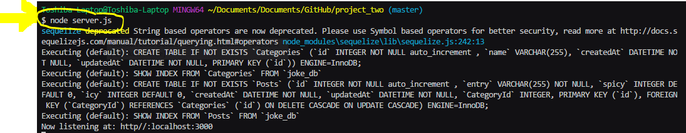
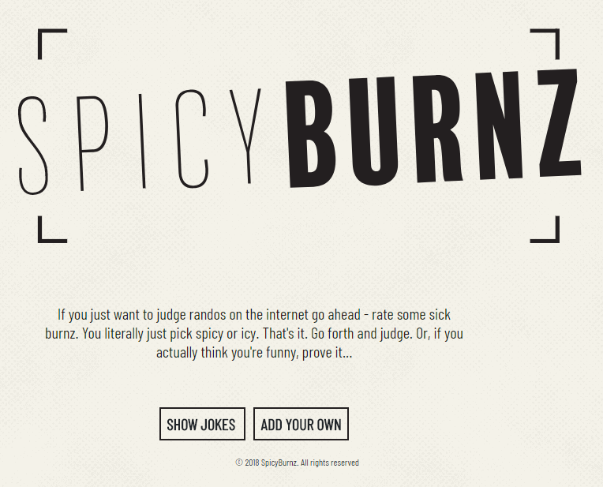
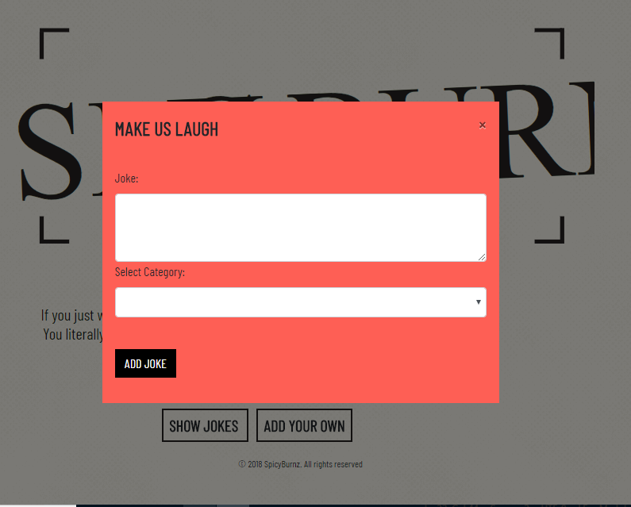
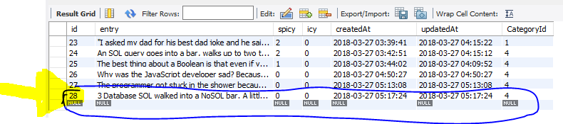
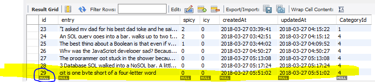
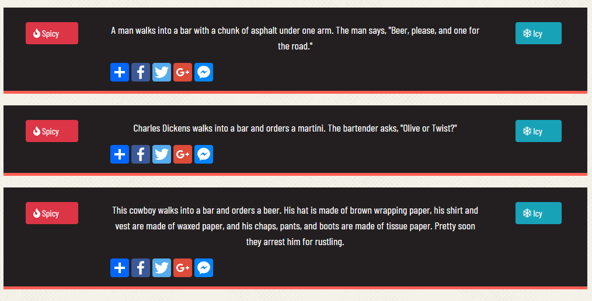
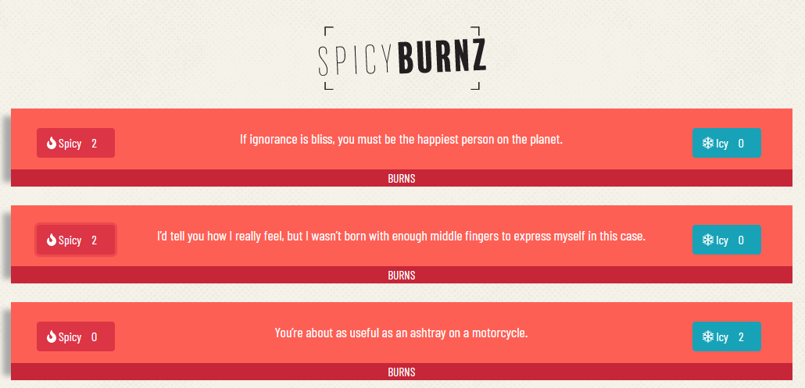

# SpicyBurnz

If you just want to judge randos on the internet go ahead - rate some sick burnz. You literally just pick spicy or icy. That's it. Go forth and judge. Or, if you actually think you're funny, prove it.

This app will take you through the fun world of jokes and burns. Be prepared to laugh and share one with your neighbor! You are brought to the main page where you have options of:
```
  1. Show Jokes
  1. Add Your Own

```

If you choose to Show Jokes you will be allowed to pick is either Spicy or Icy. Once you pick a rating for the joke you are then shown the total ratings that were already given by other users. This way the user is not influenced by the previous ratings, so it is more honest. Your Spicy or Icy rating was added to the database before the total was displayed. Another nice feature is that You also can only rate the joke as either Spicy or Icy, you cannot hit a button for a joke twice. All of this is provided by show and hide features with a little extra thrown in to make it work effortlessly. 

If you choose to `Add Your Own`, a `Make us Laugh` modal will pop up and you can add your own joke and then choose which category the joke should be placed. Once you submit the joke it is added to the database. Then the `Show Jokes` page opens. Then title animates by going smaller. The jokes only appear on the page when you start scrolling. This amazing magic is thanks to a new technology we implimented from [ScrollReveal](https://scrollrevealjs.org/). You should see the list of jokes and as you scroll more jokes are shown on the page. You should see your joke when you scroll down to the bottom of the page. 

 The jokes are colored by category:

 * Red = Burns
 * Purple = Bar Jokes
 * Yellow = Coding Jokes
 * Blue = Puns


## Getting Started

This app is deployed at [https://spicyburnz.herokuapp.com/index](https://spicyburnz.herokuapp.com/index). Or you can get the app set up on your own local computer.

These instructions will get you a copy of the project up and running on your local machine for development and testing purposes. See deployment for notes on how to deploy the project on a live system.

### Prerequisites

This app requires two programs to be installed on your computer:
* [Node.js](https://nodejs.org/en/)
* [MySQL Workbench](https://www.mysql.com/products/workbench/)

It also requires a number of NPM Packages: 
  * [Express](https://www.npmjs.com/package/express)
  * [Express-Handlers](https://www.npmjs.com/package/express-handlebars)
  * [Body-Parser](https://www.npmjs.com/package/body-parser)
  * [MySQL](https://www.npmjs.com/package/mysql)
  * [MySQL2](https://www.npmjs.com/package/mysql2)
  * [dotenv](https://www.npmjs.com/package/dotenv)
  * [fs](https://www.npmjs.com/package/fs)
  * [nightmare](https://www.npmjs.com/package/nightmare)
  * [npm](https://www.npmjs.com/package/npm)
  * [path](https://www.npmjs.com/package/path)
  * [sequelize](https://www.npmjs.com/package/sequelize)
  * [sequelize-cli](https://www.npmjs.com/package/sequelize-cli)


#### Directory structure

All the recommended files and folders from the steps above should look like the following structure, which was created that meets MVC Paradigm:

```
project_two
│
├── config
│   └── config.json
│
├── models
│   ├── category.js
│   ├── index.js
│   └── post.js
│
├── node_modules
│ 
├── public
│   └── assets
│   	  ├── css
│       │   ├── bordercorners.svg
│       │   ├── flame.png
│       │   ├── halftone.png
│       │   ├── reset.css
│       │   ├── spicyburnz.svg
│       │   ├── spicyburnzcopy.svg
│       │   └── style.css
│       ├── imgages
│       │   └── 
│       └── js
│           ├── category.js
│           ├── post.js
│      	    └── html-routes.js
│   
├── test
│   └── test.js
│  
├── views
│    ├── layouts
│    │   └── main.handlebars
│    │
│    ├── partials
│    │	  └── joke.handlebars
│		 │ 
│    ├── edit.handlebars
│    │  
│    └── index.handlebars
│        
├── package-lock.json
│
├── package.json
│ 
├── README.md
│
└── server.js

```


## Instructions on setting up and running this app on your computer

#### App Setup

1. Fork a copy to your Github repo and clone it to your computer.

1. Go to your Git Bash and got to into the folder called project_two.

1. To get all the npm packages required to run this app type into the command line `npm install`


#### Database Setup

1. On your computer, open MySQL Workbench and login to a local server you have set up. 

1. Open a new MySQL tab for executing queries. Create a database by adding the following code:

```
  CREATE DATABASE joke_db;
  USE joke_db;
```

1. Then go back to your chosen text editor (we suggest either `Visual Studio Code` or `Sublime Text`) and open your `project_two` folder.

1. Open the `config` folder and go to the config.json file. You will see at the top of the file this code:
```
{
  "development": {
    "username": "root",
    "password": "",
    "database": "joke_db",
    "host": "127.0.0.1",
    "dialect": "mysql"
  },

```  
1. If you use a password for your MySQL, enter it between the quotes so it looks like this: `"password": "your password here"` and save the file.


#### Open App in Browser

1. In the command line go into main folder of `project_two`

1. Type `node server.js` end hit enter




1. Go to your browser and open a new tab and type `localhost:3000` then hit enter. This is what you should see:




#### Using the App


**Clicking Add Your Own Button**

* When you click on the `Add Your Own` button 

* A modal will open titled `Make Us Laugh`, here I have added a joke:
	


* Here is the database before added a joke, please note that the joke has not been added yet:
	


  * Here is the database after added a joke, you can see the joke I added is now at the bottom of the rows:
	


**Clicking Show Jokes Button**

* One of the important feature of this app is that you cannot see how others have rated the joke until you do, this keeps you honest as how you rate the joke is not influence by the ratings of others. The other is that you cannot click either of the buttons after the ratings have been shown.

* Here is the page before I rated the jokes to be either Spicy or Icy:
	
	

* Here is the page after I rated the jokes to be Spicy or Icy:

	


* To show you how the database has changed, here is the database before rating the jokes. Note the Spicy and Icy values of the top three jokes:

	

* Here is the database after rating the jokes. Note either the Spicy or Icy values of each joke have change:

	 


## Deployment

This application is delployed at [https://spicyburnz.herokuapp.com/index](https://spicyburnz.herokuapp.com/index)


## TheSpicyBurnz Team
This was a group effort, with a great group of coders to work with. Below are the team members' names with links to their individual github pages:
* [Jeff Studenski](https://github.com/jstudenski)
* [Sara Bracewell](https://github.com/2crazyflowers)
* [Kate Brothern](https://github.com/brothernk)
* [Chris York](https://github.com/cyork27)


## Issues or Future wants for the App


We did not have the time to add `Share A Joke` button, which will allow you to share a joke you like with a friend via either FaceBook or Twitter. Here is the link to the what we found to help us share:
[Find out more.](https://developers.facebook.com/docs/plugins/share-button) 
